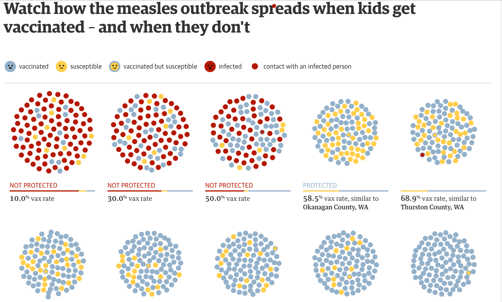
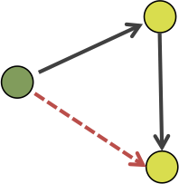
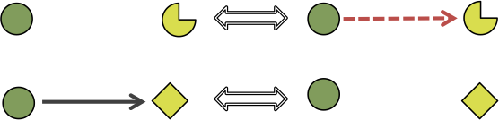
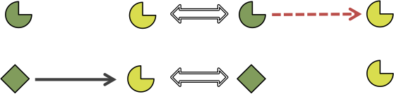

```{r setup, include=FALSE}
knitr::opts_chunk$set(echo = FALSE, message = FALSE, warning = FALSE, cache = TRUE)
```

```{r pkgsdat, results='hide'}
# load all necessary package
library(tidyverse)
library(network)
library(RSiena)
library(GGally)
library(plotly)
library(geomnet)
library(netvizinf)

# load data
simu2 <- read_csv("data/simulation-1000-M1-M2-M3.csv")
m2sims <- read_csv("data/m2sims20.csv")
load("data/ansnullpaper.rda")
drink1 <- s50a[20:35,1]
drink2 <- s50a[20:35,2]
drink3 <- s50a[20:35,3]
fd2.w1 <- s501[20:35, 20:35]
colnames(fd2.w1) <- paste0("V", 1:16)
rownames(fd2.w1) <- paste0("V", 1:16)
fd2.w2 <- s502[20:35, 20:35]
colnames(fd2.w2) <- paste0("V", 1:16)
rownames(fd2.w2) <- paste0("V", 1:16)
fd2.w3 <- s503[20:35, 20:35]
colnames(fd2.w3) <- paste0("V", 1:16)
rownames(fd2.w3) <- paste0("V", 1:16)
smallfriends <- read_csv("data/smallfriends4Geomnet.csv")
smallfriends %>% 
  #mutate(from = ifelse(is.na(X1), NA, paste0("V", X1)),
  #       to = ifelse(is.na(X2), NA, paste0("V", X2))) %>% 
  mutate(from = as.factor(X1), to = as.factor(X2)) %>% 
  select(from, to, drink, Wave) -> smallfriends
friendshipData <- array(c(fd2.w1, fd2.w2, fd2.w3), dim = c(16, 16, 3))
friendship <- sienaDependent(friendshipData)
alcohol <- varCovar(cbind(drink1,drink2, drink3))
mydata <- sienaDataCreate(friendship, alcohol)
M1eff <- getEffects(mydata)
M2eff <- includeEffects(M1eff, jumpXTransTrip, interaction1 = "alcohol")
M3eff <- includeEffects(M1eff, nbrDist2twice)
```

## Outline

- Motivating Example
- Working Example
- Model & Visualizations

## Motivating Example

Childhood vaccination - major public health concern

- [Vaccination animation](https://www.theguardian.com/society/ng-interactive/2015/feb/05/-sp-watch-how-measles-outbreak-spreads-when-kids-get-vaccinated)



## Questions

Interactions in animation aren't realistic - people don't behave like bacteria in petri dishes!

- How do community beliefs affect vaccination rate?
- How do those beliefs spread in a population? 
- How does community structure affect spread of disease from outside source? 
- What other factors lead to unvaccinated children?
- Can communities be identified and targeted for immunization programs/initiatives?

> Can we use network modeling to answer these questions? 

## Working Example

Another public health concern - underage drinking & smoking (Steglich, Snijders & Pearson 2010)

Data from "Teenage Friends and Lifestyle Study" (Pearson & Mitchell (2000); Pearson & West (2003))

- Glasgow, Scotland, UK, Feb 1995 - Jan 1997
- Panel data - three waves - aged 12-13 to 14-15
- Each student lists up to 6 school friends
- Smoking & drinking behavior, other lifestyle variables collected
- 160 students in total, only 50 in [example data](https://www.stats.ox.ac.uk/~snijders/siena/)
- We use an even smaller subset of 16 pupils

## Network Visualization

```{r dataviz}
set.seed(3345876)
alldataviz <- ggplot(data = smallfriends, 
       aes(from_id = from, to_id = to, color = as.ordered(drink), group = as.ordered(drink))) +
  geom_net(fiteach = FALSE, directed=TRUE, layout.alg = 'fruchtermanreingold', size = 5, arrowsize = .5, arrowgap = .04, linewidth = .5, ecolour = 'grey40', labelon=T, labelcolour = 'black', fontsize = 3, vjust = .5) +
  scale_color_brewer(palette = "YlOrRd", name = "Drinking\nBehavior") + 
  theme_net() +
  facet_wrap(~Wave, labeller = "label_both") + 
  theme(legend.position = 'bottom', panel.background = element_rect(fill = NA, color = "grey30"))
alldataviz
```

## Model

- Want: to determine how friendships change risky behavior and vice versa over time
- Solution: stochastic actor-oriented models (SAOMs) for networks (Snijders 1996)
    * Stochastic because they model network change over time
    * Actor-oriented because actor-level covariates are incorporated into model parameters i.e. drinking behavior taken into account when modeling network change
    * Network structure can also be taken into account when modeling behavior change 
    
## How do SAOMs work?

Just consider modeling network change for now

- Change doesn't happen all at once, but observations are discrete.
    * Many unobserved changes between discrete time points
    * Model unobserved data as Continuous-time Markov chains (CTMCs) 
- Ties are dependent, with a complex dependency structure
    * Condition on wave 1 (need at least 2 observations in data)
    * For steps in CTMC, condition on all current ties

## Markov Chain process     

- Choose one actor (call it $i$) to (potentially) make a change.
    * Probability of actor choice depends on rate function
- Actor $i$ tries to optimize some utility function by changing ties or not
    * Choose a "best" friend to have or a "worst" friend to cut loose 
    
```{r computations}
ansnullchains <- netvizinf::get_chain_info(ansnull)
chainsms <- ansnullchains %>% 
  group_by(rep, period) %>% 
  mutate(microstep = row_number(), 
         prob = exp(logAlterProb),
         from = paste0("V", as.numeric(as.character(ego))+1),
      to = paste0("V", as.numeric(as.character(alter))+1)) %>%
  ungroup()
wave1friends <- fortify(as.adjmat(fd2.w1))
ms1 <- netvizinf::listMicrosteps(dat = wave1friends,
                      microsteps = filter(chainsms, rep == 3, period == 1))

ms1df <- plyr::rbind.fill(lapply(X = seq_along(ms1), FUN = function(i, x) {
        x[[i]]$ms <- i - 1
        return(x[[i]])
    }, ms1))
microsteps <- ms1[1:4]
microsteps_df <- getMicrostepsDF(microsteps)
pte <- pretween_edges(microsteps = microsteps)
ptv <- pretween_vertices(pte = pte, layoutparams = list(n = 16))
pall <- tween_microsteps(ptv, pte, microsteps_df)
pgif <- netvizinf::create_net_animate(pall)
#animation::ani.options(list(interval = 1/4, ani.width = 10, ani.height = 10))
#gganimate::gganimate(pgif, "img/smallfriendsms1-3.gif", title_frame = F)
```

## Rate Function

Rate at which actors are selected to act

- Simple rate parameter, $\alpha$, for all actors
    * Can be a function of network statistics or actor covariates, but keep it simple for our purposes 
- Waiting time for *one* actor to act $\sim Exp\left(\frac{1}{\alpha}\right)$
- Waiting time for *any* actor to act $\sim Exp\left(\frac{1}{n\alpha}\right)$
- Probability that actor $i$ will be the next one to act is $\frac{1}{n}$, where $n$ is the number of actors in the network

## Transition Steps


## Objective Function

When actor $i$ can change, it tries to maximize its objective function:

$$f_i(x, \mathbf{z}, \boldsymbol{\beta}) = \sum_k \beta_k s_{ik}(x, \mathbf{z})$$

- $x$ is the network state
- $\mathbf{z}$ is a matrix of actor-level covariates
- $s_{ik}(x, \mathbf{z})$ are network & covariate statistics
- $\beta_k$ are the parameters to be fit in the model
- There can be any number of $\beta_k$ added to the model (problematic)

## Transition Probability 

The probability that actor $i$ will change the tie to actor $j$ is: 

$$p_{ij} = \frac{\exp\left\{f_i(x(i\leadsto j), \mathbf{z}, \boldsymbol{\beta})\right\}}{\sum_h \exp\left\{f_i(x(i\leadsto h), \mathbf{z}, \boldsymbol{\beta})\right\}}$$
- $x(i\leadsto j)$ is the network identical to the current state, $x$, except for $x_{ij}$, which becomes $1-x_{ij}$ 

## Transition Probability Heatmap

```{r heatmap}
# first do just the first rep's microsteps for PCA
# ms1df %>% group_by(from, to) %>% count() %>% 
#   spread(to, n, fill = 0) %>% data.frame -> dopca
# rownames(dopca) <- dopca$from
# dopca <- as.matrix(dopca[,-1])
# pca.ms1 <- prcomp(dopca)
# absorder <- names(sort(abs(pca.ms1$rotation[,1]), decreasing = T))
# raworder <- names(sort(pca.ms1$rotation[,1], decreasing = T))
# 
# chainsms %>%
#   filter(microstep == 1 & period == 1) %>% 
#   select(-rep) %>% unique %>% 
#   ggplot() + 
#   geom_tile(aes(x = factor(from, levels = raworder), 
#                 y = factor(to, levels = raworder), fill = prob))

# hm i don't like the look of that, now try PCA on matrix of all 1000 first ms's

chainsms %>%
  filter(microstep == 1 & period == 1) %>% 
  group_by(from, to) %>% count %>%
  spread(to, n, fill = 0)  %>% data.frame -> dopca2 
rownames(dopca2) <- dopca2$from
dopca2 <- as.matrix(dopca2[,-1])
pca.ms1.2 <- prcomp(dopca2)
absorder2 <- names(sort(abs(pca.ms1.2$rotation[,1]), decreasing = T))
raworder2 <- names(sort(pca.ms1.2$rotation[,1], decreasing = T))

chainsms %>%
  filter(microstep == 1 & period == 1) %>% 
  select(-rep) %>% unique -> datplot 
datplot$from <- factor(datplot$from, levels = raworder2)
datplot$to <- factor(datplot$to, levels = raworder2)
# p <- ggplot(datplot) + 
#   geom_tile(aes(x = from, 
#              y = to, fill = prob), color = 'black') +
#   scale_fill_gradient(low = "#d8edd5", high = "#006d2c", name = "Transition\nProbability") +
#   coord_fixed() + 
#   labs(x = "i", y = "j") + 
#   theme_classic()
# ggplotly(p)
```

<iframe src="img/heatmap.html" width="90%" height="90% scrolling="no" seamless="seamless" frameBorder="0"> </iframe>

## (Some) Possible Model Parameters 

Network Effect | Sufficient Statistic | Interpretation
------------------|----------------------|----------------
outdegree*        | $s_{i1}(x) = \sum_j x_{ij}$ | Popularity
reciprocity*       | $s_{i2}(x) = \sum_j x_{ij}x_{ji}$ | Reciprocated relationships
transitive triplets | $s_{i3}(x) = \sum_{j,h} x_{ij}x_{jh}x_{ih}$ | Your friend becomes my friend

Covariate Effect | Sufficient Statistic | Interpretation
-----------------|----------------------|-----------------
covariate-alter  | $s_{i4}(x) = \sum_j x_{ij}z_j$ | Effect of my friend's behavior on friendship
covariate-ego    | $s_{i5}(x) = z_i\sum_j x_{ij}$ | Effect of my behavior on friendship
same covariate   | $s_{i6}(x) = \sum_j x_{ij} \mathbb{I}(z_i = z_j)$ | Birds of a feather flock together

## (Some) Possible Model Parameters 

Network Effect | Interpretation | Visualization
------------------|----------------|----------------
outdegree*        | Popularity | 
reciprocity*      | Reciprocated relationships | 
transitive triplets | Your friend becomes my friend | 

Covariate Effect | Interpretation | Visualization
-----------------|----------------|-----------------
covariate-alter  | Effect of my friend's behavior on friendship | 
covariate-ego    | Effect of my behavior on friendship | 
same covariate   | Birds of a feather flock together | 

## Small SAOMs Example

- Our small subset of the 50 friends data
- Fit three models for network evolution
- M1: "straw man" model that only has 2 parameters in obective function

## Complete Animation

```{r make gif}
microsteps <- ms1
microsteps_df <- getMicrostepsDF(microsteps)
pte <- pretween_edges(microsteps = microsteps)
ptv <- pretween_vertices(pte = pte, layoutparams = list(n = 16))
pall <- tween_microsteps(ptv, pte, microsteps_df)
pgif <- netvizinf::create_net_animate(pall)
#animation::ani.options(list(interval = 1/4, ani.width = 10, ani.height = 10))
#gganimate::gganimate(pgif, "img/smallfriends.mp4", title_frame = F)
```

One simulation of the microstep process from wave 1 to wave 2


## Other models

Chose additional parameters because of very low $p$-values ($p$ < 0.001) according to `RSiena` (Ripley et al 2016)

- M2: M1 with one significant *covariate* effect added (drinking behavior encourages transitive ties)
- M3: M1 with one significant *structural* effect added (discourages transitive ties, encourages social distance)

Some Questions:

1. How do additional parameters affect the model fit?
2. Can we *see* the significance of these parameters? 


## Distributions of Fitted Model Effects 

```{r distests}
# p <- ggplot(data = simu2) + 
#   geom_density(aes(x = estimate, fill = Model), alpha = .5) + 
#   facet_wrap(~parameter, scales = 'free') + 
#   theme_bw()
# ggplotly(p)
```

<iframe src="img/distributions.html" width="100%" height="100% scrolling="no" seamless="seamless" frameBorder="0"> </iframe>

## Correlation of Estimates

```{r corplot}
simu_spread <- simu2 %>% spread(parameter, estimate)
p <- ggpairs(simu_spread, columns = 3:8, ggplot2::aes(colour=Model, alpha = .5)) + theme_bw()
p
#ggplotly(p)
```

## Examining Model Fit

```{r lineup}
actual2 <- merge(data.frame(as.edgelist(as.network(fd2.w2))), 
                 data.frame(id = 1:16, drink = drink2), 
                 by.x = "X1", by.y = "id", all = T)
set.seed(1234567)
plots <- sample(20, 5)
lineupdat <- m2sims %>% filter(count %in% plots)
nulldat <- lineupdat[,-1]
names(nulldat) <- c("from", "to", "count")
datdat <- actual2
datdat <- datdat[,1:2]
datdat$count <- 1001
names(datdat) <- c("from", "to", "count")
exlu <- rbind(nulldat, datdat)
exlu <- exlu %>% mutate(from = ifelse(is.na(from), NA, paste0("V", from)),
                        to = ifelse(is.na(to), NA, paste0("V", to)))
set.seed(34925)
exlu$plot_order <- rep(sample(6), as.vector(table(exlu$count)))
ggplot(data = exlu) + 
  geom_net(aes(from_id = from, to_id = to), fiteach = T, size = 2, linewidth = .5) + 
  facet_wrap(~plot_order) + 
  theme_net() + theme(panel.background = element_rect(fill = NA, colour = 'black'))
```

## "Average" Network

```{r avgs}
actual1 <- merge(data.frame(as.edgelist(as.network(fd2.w1))), 
                 data.frame(id = 1:16, drink = drink1), 
                 by.x = "X1", by.y = "id", all = T)
means <- simu2 %>% group_by(Model, parameter) %>% summarize(
  means = mean(estimate)
)
M1parms <- (means %>% filter(Model == "M1"))$means
M2parms <- (means %>% filter(Model == "M2"))$means
M3parms <- (means %>% filter(Model == "M3"))$means
set.seed(4231352)
M1sims1000 <- saom_simulate(dat = mydata, 
                            struct = M1eff,
                       parms = as.numeric(M1parms), 
                       N = 1000)
M2sims1000 <- saom_simulate(dat = mydata, 
                            struct = M2eff,
                       parms = as.numeric(M2parms), 
                       N = 1000)
M3sims1000 <- saom_simulate(dat = mydata, 
                            struct = M3eff,
                       parms = as.numeric(M3parms), 
                       N = 1000)
M1simsdf <- sims_to_df(M1sims1000)
M2simsdf <- sims_to_df(M2sims1000)
M3simsdf <- sims_to_df(M3sims1000)
M1avgW2 <- M1simsdf %>% filter(!is.na(to) & wave == 2) %>%
  group_by(from, to) %>% 
  summarise(count = n()) %>% 
  mutate(weight = ifelse(from == to, 0, count))
M2avgW2 <- M2simsdf %>% filter(!is.na(to) & wave == 2) %>%
  group_by(from, to) %>% 
  summarise(count = n()) %>% 
  mutate(weight = ifelse(from == to, 0, count))
M3avgW2 <- M3simsdf %>% filter(!is.na(to) & wave == 2) %>%
  group_by(from, to) %>% 
  summarise(count = n()) %>% 
  mutate(weight = ifelse(from == to, 0, count))

# make a df of wave 2, wave 1, and the three averages and facet. 
names(actual1)[1:2] <- c("from", "to")
names(actual2)[1:2] <- c("from", "to")
actual1$count <- 1
actual1$weight <- 1
actual2$count <- 1
actual2$weight <- 1
actual1 <- actual1 %>% select(from,to, count, weight)
actual2 <- actual2 %>% select(from,to, count, weight)
actual1$cat <- "First Observation"
actual2$cat <- "Second Observation"

avgW2M1 <- M1avgW2 %>% ungroup() %>% 
  filter(weight > 50) %>% 
  mutate(from = as.factor(from), to = as.factor(to),
         cat = "Model1")
add1 <- setdiff(as.character(1:16), unique(c(as.character(avgW2M1$from), as.character(avgW2M1$to)))) 
avgW2M1 %>% add_row(from = add1, to = NA, count = NA, weight = NA, cat = "Model1") -> avgW2M1
avgW2M2 <- M2avgW2 %>% ungroup() %>% 
  filter(weight > 50) %>% 
  mutate(from = as.factor(from), to = as.factor(to),
         cat = "Model2")
add2 <- setdiff(as.character(1:16), unique(c(as.character(avgW2M2$from), as.character(avgW2M2$to)))) 
avgW2M2 %>% add_row(from = add2, to = NA, count = NA, weight = NA, cat = "Model2") -> avgW2M2
avgW2M3 <- M3avgW2 %>% ungroup() %>% 
  filter(weight > 50) %>% 
  mutate(from = as.factor(from), to = as.factor(to),
         cat = "Model3")
add3 <- setdiff(as.character(1:16), unique(c(as.character(avgW2M3$from), as.character(avgW2M3$to)))) 
avgW2M3 %>% add_row(from = add3, to = NA, count = NA, weight = NA, cat = "Model3") -> avgW2M3

combinedavgs <- rbind(actual1, actual2, avgW2M1, avgW2M2, avgW2M3)
combinedavgs %>% group_by(cat) %>% 
  mutate(linewidth = weight / max(weight,na.rm = T)) -> combinedavgs

ggplot(data = combinedavgs) + 
  geom_net(aes(from_id = from, to_id = to, linewidth= linewidth),
           directed = T, curvature = .1, fiteach = T,
           singletons = T) +
  theme_net() + 
  facet_wrap(~cat)
```  

## Conclusion

- Can use visualization to learn about the model
- "Model Visualization" (Wickham et al 2015)
    * Model in the data space and data in the model space
    * Collections are more informative than singletons
    * Explore the process, not just the end result

## References {.smaller}

Pearson, M. and Michell, L. 2000. "Smoke Rings: Social Network Analysis of Friendship Groups, Smoking, and Drug-Taking." *Drugs: Education, Prevention and Policy* 7(1):21-37.

Pearson, M. and West, P. 2003. "Drifting Smoke Rings: Social Network Analysis and Markov Processes in a Longitudinal Study of Friendship Groups and Risk-Taking." *Connections* 25(2):59-76.

Ripley, R., Boitmanis, K., Snijders, T.A.B., & Schoenenberger, F. 2016. *RSiena: Siena - Simulation Investigation for Empirical Network Analysis.*  R package version 1.1-304/r304. [URL](https://R-Forge.R-project.org/projects/rsiena/)

Steglich, C., Snijders, T.A.B, and Pearson, M. 2010. "Dynamic Networks and Behavior: Separating Selection from Influence." *Sociological Methodology.* 40(1):329-393.

Snijders, T.A.B. 1996. "Stochastic actor-oriented models for network change." *Journal of Mathematical
Sociology* 21:149-172.  

Wickham, H., Cook, D., and Hofmann, H. 2015. "Visualizing Statistical Models: Removing the Blindfold." *Statistical Analysis and Data Mining: The ASA Data Science Journal* 8(4):204-225.